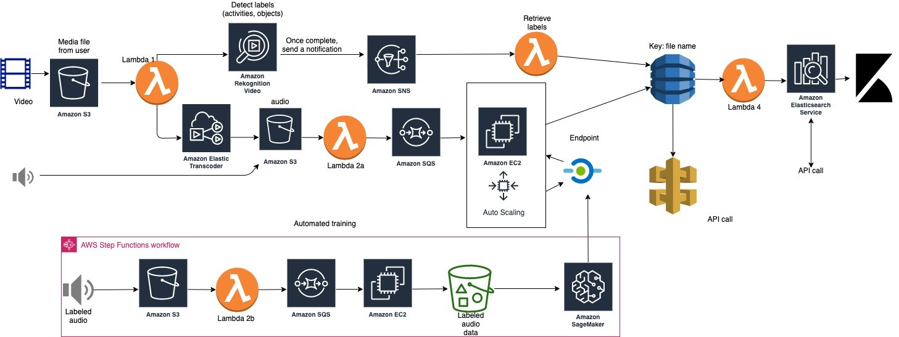

# audio_video_labeling

To make videos and audios searchable, one thing we can do is to detect labels from these media assets. Machine can do this faster, cheaper, and easy to scale.

# Video detection

I use Amazon Rekognition to detect objects and scenes in the video. I save these labels in DynamoDB. Large video files might takes some time to process. I use SNS and Lambda in between to get results once Recognition is done.

# Audio detection

Amazon Elastic Transcode separates the audio from the uploaded video. The data science part of detecting label from audio is not as straightforward as an arrow. I trained a machine learning model using some open source dataset. The model can detect about 300+ audio labels (such as piano, wind, dog bark, etc.). Raw audio needs to go through several steps of processing, include framing, FFT, and encoding. The encoding is used to shrink the size of input for easy training. Tried a few models and found a simple LSTM based network performs well. Fancy models in literature performs slightly better but don't justify the extra complexity. To make the retraining easy, I use Step Functions to automated the process.

# Inference

Inference is done by SageMaker Endpoint in real time. Since preprocessing raw audio involves steps cannot be easily done in Spark or other commonly used frameworks, I use the old fashion EC2. A SQS queue is set up to make sure not files are lost. The EC2 instance retrieves messages from SQS, download raw files and process it. It also send processed data to SageMaker Endpoint for inference, and write label to DynamoDB afterwards. Auto Scaling ensures that during peak demand period, there is still enough EC2 to work on preprocessing.

Search and look up

Can query DynamoDB directly to look up labels of any media file. Use EasticSearch to visualize and search for desired labels.

